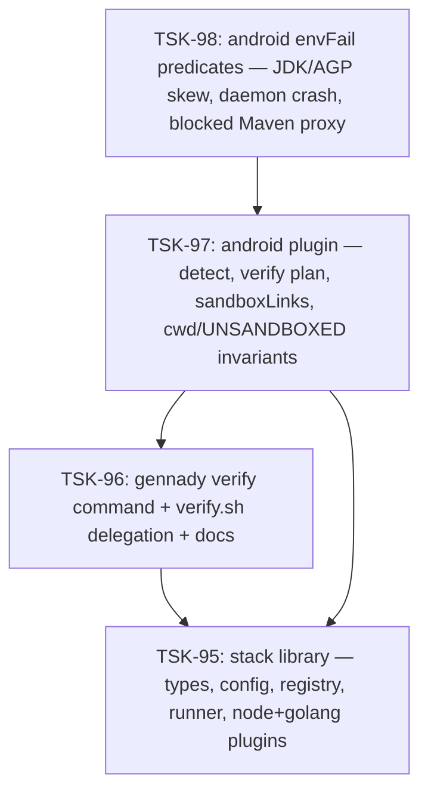

# Tasks: stack

## Scope Spec

- [Scope spec](../../specs/stack/stack.spec.md)

## Cascade Table

Effective rules for tasks in this scope. Derived from scope graph (depends-on transitive closure).

Tier order (low → high priority on collision): `traversed-scopes` → `target-scope` → `module:<name>` → `task`.

| Tier                   | coding           | testing   |
| ---------------------- | ---------------- | --------- |
| infra-base (traversed) | typescript-rules | node-test |
| shared (traversed)     | typescript-rules | node-test |
| stack (target)         | typescript-rules | node-test |

### Rule Sources

- Traversed scopes: [scope graph](../../specs/README.md)
- Files: `ai/directives/coding/typescript-rules.xml`, `ai/directives/testing/node-test.xml`

## Intra-Scope DAG

## Tracker

| Task   | Title                                                                       | Status   |
| ------ | --------------------------------------------------------------------------- | -------- |
| TSK-95 | stack library: types, config, registry, runner, node+golang                 | [x] DONE |
| TSK-96 | `gennady verify` command, verify.sh delegation, docs, skills                | [x] DONE |
| TSK-97 | android plugin: detect + verify + sandboxLinks + invariants                 | [x] DONE |
| TSK-98 | android envFail predicates: JDK/AGP skew, daemon crash, blocked Maven proxy | [x] DONE |
